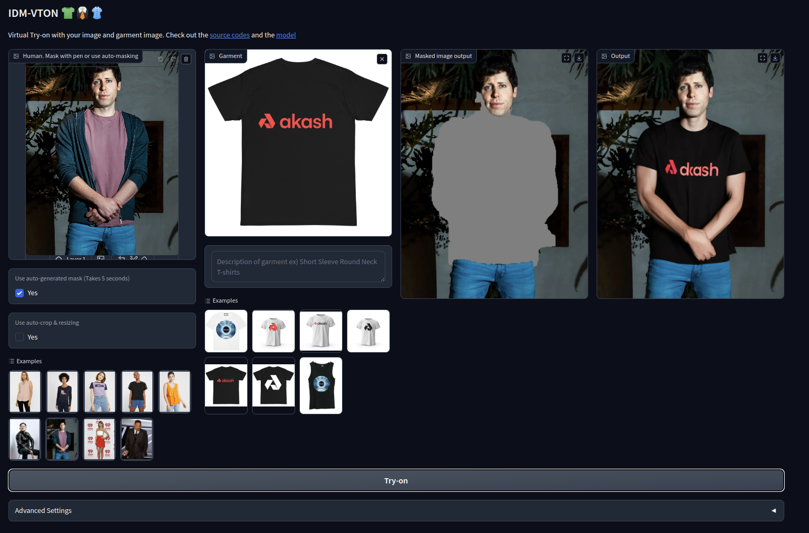

# Virtual Try-On on Akash



This application is an adapted version of the [https://huggingface.co/spaces/yisol/IDM-VTON](https://huggingface.co/spaces/yisol/IDM-VTON) space. All credits go to the awesome work of the authors.

```
@article{choi2024improving,
  title={Improving Diffusion Models for Virtual Try-on},
  author={Choi, Yisol and Kwak, Sangkyung and Lee, Kyungmin and Choi, Hyungwon and Shin, Jinwoo},
  journal={arXiv preprint arXiv:2403.05139},
  year={2024}
}
```


The project is developed for the **Akash Console** zealy task which is hosted by [Akash](https://zealy.io/cw/akashnetwork/questboard) for fun and educational purposes.

## Deploy on Akash guide 

- Create and fund a Keplr or Leap wallet
  - [Keplr wallet](https://akash.network/docs/getting-started/token-and-wallets/#keplr-wallet)
  - [Leap wallet](https://akash.network/docs/getting-started/token-and-wallets/#leap-cosmos-wallet)
- Visit https://deploy.cloudmos.io/
- Connect your wallet
  - You need to have at least 0.5 AKT in your wallet
- Press the deploy button
- Select "Build your template"
- (Optional) Name your deployment
- Select YAML and paste the [deploy.yaml](deploy.yaml) contents
- Press "Create Deployment"
- Accept wallet transaction
- Review bids and select provider
- Accept provider transaction
- Go to LEASES and press the URI
- Check the [Akash docs](https://akash.network/docs/deployments/cloudmos-deploy/) if you have and questions
- Use Virtual Try-on on Akash!

## Important Notes
- Need to be patient because the app needs to download **28GB** model checkpoints
- Requires GPU with >= **32 GB VRAM**